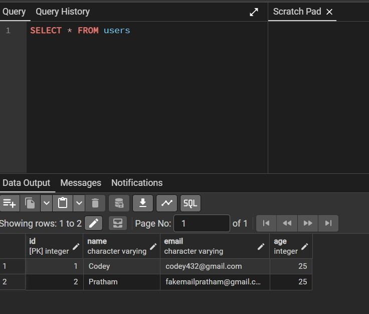
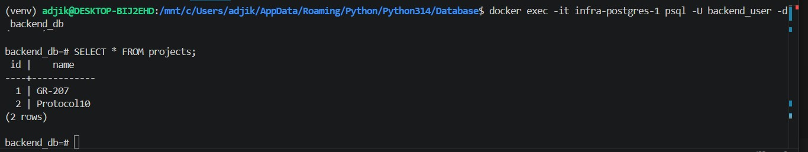
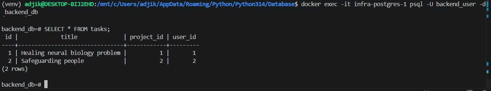
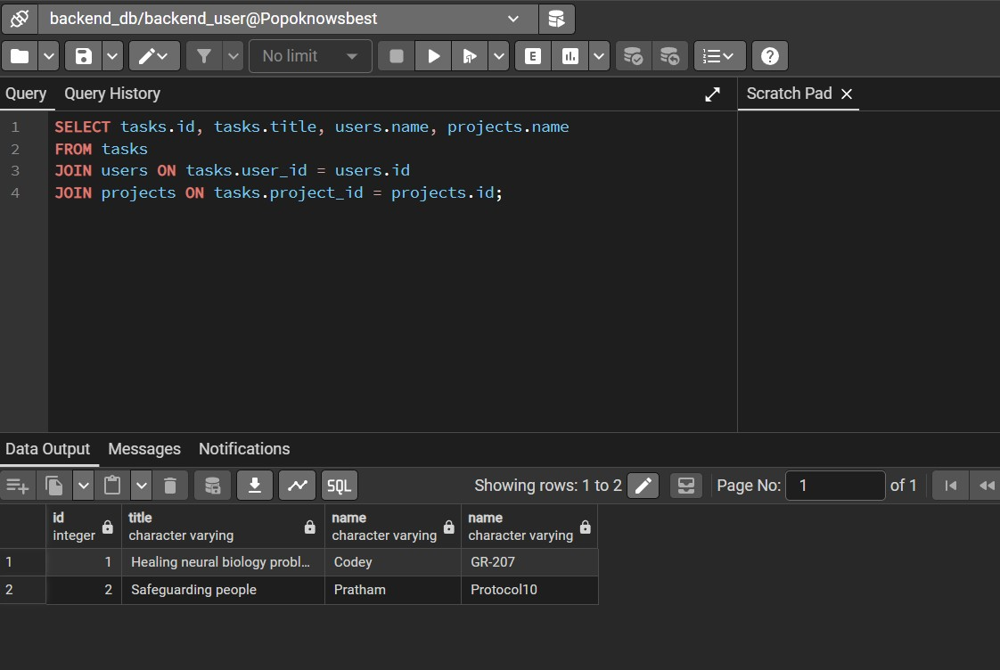

# FastAPI + PostgreSQL Persistent Storage

A backend application that stores data permanently using FastAPI and PostgreSQL. 
Supports full CRUD operations across three relational tables — users, projects, and 
tasks — with system health monitoring via MongoDB, database migrations via Alembic, 
and local PostgreSQL hosting through Docker.

---

## Key Features
- Three relational tables: `users`, `projects`, and `tasks` with one-to-many relationships
- Persistent storage via PostgreSQL — data survives server restarts
- Alembic migrations for version-controlled schema changes
- MongoDB health monitoring via `health.py`
- Full CRUD through FastAPI's interactive docs
- Dockerized PostgreSQL for local development

---

## Tech Stack
| Tool | Purpose |
|---|---|
| FastAPI | API framework |
| PostgreSQL | Primary database |
| SQLAlchemy | ORM |
| Alembic | Database migrations |
| MongoDB + Motor | Health monitoring |
| Pydantic | Data validation |
| Docker | Local PostgreSQL hosting |
| Poetry | Dependency management |
| Uvicorn | ASGI server |

---

## Project Structure

The project is broken into five layers:

### Models
Defines table columns, constraints, and relationships. `membership_model` acts as a 
join table between users and projects using `user_id` and `project_id` as composite 
foreign keys.

### Schemas
Controls what values can be written and returned. Response schemas handle 
one-to-many relationships (e.g. one user → many tasks).

### Repository
Handles all direct database communication. Introduced in this version as the project 
scope grew beyond what a single service layer could cleanly manage.

### Service
Contains business logic. Validates incoming data against existing records before 
performing any write operations, and calls the repository layer to execute queries.

### Routes
Binds everything together. Exposes endpoints through FastAPI and delegates to the 
service layer for all operations.

---

## Running the App

### Migrations
```bash
# Generate a new migration
alembic revision --autogenerate -m "your message"

# Apply migrations
alembic upgrade head

# Roll back one step
alembic downgrade -1

# View migration history
alembic history
```

### Start the server
```bash
uvicorn app.main:app --reload
```

---

## Docker

PostgreSQL runs locally via Docker:

```bash
# Start containers
docker compose up -d

# Stop and remove volumes
docker compose down -v

# Check running containers
docker ps

# Access PostgreSQL directly
docker exec -it <container_name> psql -U <username> -d <database>
```

---

## Security Notes
- Sensitive values (DB credentials, passwords) are stored in `.env` and excluded via `.gitignore`
- An `.env.example` is provided as a reference template
- Alembic and Python cache files are also excluded

---

## Output

### User Table


### Project Table


### Tasks Table


### Relationships


---

## Conclusion
The biggest upgrade from the previous version is persistence. Previously, all data 
was lost on server shutdown. With PostgreSQL and MongoDB now integrated, data 
survives restarts and the system is observable at all times.


## Miscellanous 
There is a base.py that is empty that Iam saving for future use, same goes for logger.py inside utils sub directory. I might need it later for either next week's assessment for my own personal use. 